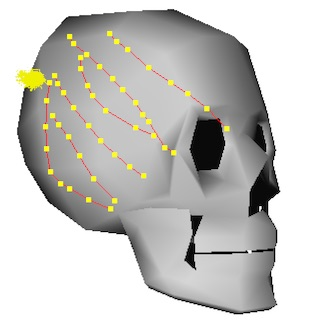
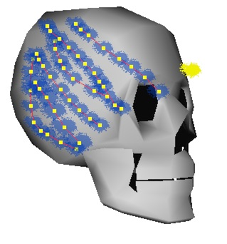
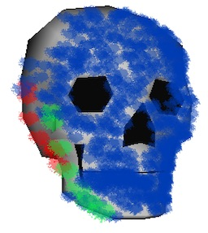
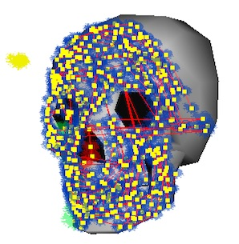
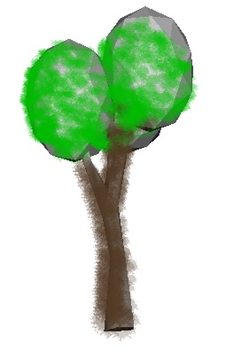
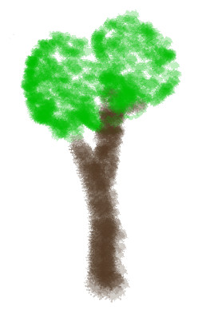

3D Paint 
--------------------------
**10/30/16**

In 2012 I came across the paper [OverCoat: An Implicit Canvas for 3D Painting][1]
which describes a technique for creating 3D models using traditional painting methods.
At the time I didn't have sufficient mathematical knowledge
to understand all of the technical details described, but I picked up the general idea and wrote my own rough implementation.
This article explains how my program was constructed and some of what I learned in the process.

The basic idea is to paint 3d strokes onto a rough 3D model which acts as a canvas. 
The model is simply rotated to a desired orientation, and drawn upon, as if one was painting ontop of a flat a picture. 
The difference is that the strokes are projected into 3D space giving them their own 3D form.

The model is only a placeholder which is eventually removed, leaving only the painting made up of strokes.
To position the nodes which define a stroke, my program simply performed a ray-triangle test between the mouse ray and the mesh, and offset the intersection point by the face normal. 
The paper describes a sophisticated optimization method which evenly distributes stroke nodes, even across harshes changes in depth.

The image above shows several strokes projected onto the surface of the model.
Along with the node positions, information such as a color and brush size are stored for each stroke. 

I used the following data structures:

    typedef struct
    {
        Vec4_t color;
        int brush;
        float pressure;
    } StrokeInfo_t;

    typedef struct
    {
        Vec3_t pos;
        float radius;
    } StrokeNode3D_t;

    typedef struct
    {
        int nodeCount;
        StrokeNode3D_t nodes[MAX_STROKE_NODES];
        Vec4_t color;
        // used for depth sorting
        Vec3_t center;
        StrokeInfo_t info;
    } Stroke3D_t;

    typedef struct
    {
        int strokeCount;
        Stroke3D_t strokes[MAX_STROKES];
        int dirty;
    } Canvas3D_t;

To render the strokes, each node position is transformed from 3D onto the 2D screen, using the camera matrix. The brush image is then rendered onto the framebuffer at each of the 2D node positions on the screen. Even though these screenshots show only a few colors and a single brush, the program supports multiple brush types and RGB colors.

 

As the drawing becomes more dense, the strokes begin to resemble their own shape. 
Rendering strokes is a very efficient process because it only involves stamping the brush image in 2D, which is easily parallelized on the GPU.
For the strokes to be drawn in the correct order they must be sorted by depth. This is by far the most computational expensive part of the process.
My program solved this problem by only sorting strokes by their average position, which seemed to be an acceptable alternative to sorting each node.
The order in which the nodes of a stroke are rendered is still important to ensure proper layering. An offline rendering process should sort each node properly.

 

Although my program cannot produce the beautiful paintings found in the original paper, it can still draw some fun pictures.
I think the technique itself is very interesting and has great potential. It would be interesting to make a small game, or animation centered around the technique since the artwork is so easy and natural to produce.
Because it requires no textures, other than the small brushes, its memory usage is also very small, while its vertex requirements are similar to triangle meshes.
The next natural step would be to bind a painting to a skeleton for animation.

[1]: http://zurich.disneyresearch.com/OverCoat/
