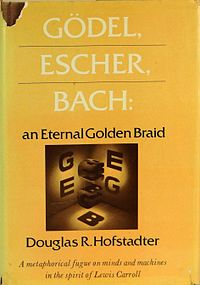

Foundation of Math Reading List
-------------------------------

**04/13/2019**

A few years ago I took a philosophy of language class which
introduced me to the foundations of math project.
It became one of my 
to study and since then I have read many books about it, and discovered
some of my favorite books of all time.

I wanted to organize some of the books I read into a list for others
who are interested in the topic.
You will notice a theme in my commentary.
The books I like most are those that don't
shy away from hard technical knowledge, but also
explore the philosophical ideas behind them.

Many good books were left out in favor of the very best.
They are arranged in a logical sequence
that will help prepare you for the next one.

### Logicomix

By: Apostolos Doxiadis

Logicomix is actually a comic book (or graphic novel as the kids say) that tells
an engaging historical narrative about the search for the foundations of math
and the beginning of analytic philosophy in the early 20th century. 

It introduces you to all the major characters
such as Gödel, Russel, Frege, and Wittgenstein and 
motivate the kinds of problems they were trying to solve.
The book also explores how these ideas connect to modern computer science.

It is an absolute joy to read and will give you a taste
of whether this is an interesting subject for you.

### Gödel, Escher, Bach

By: Douglas Hofstadter

You probably have seen this work recommended elsewhere. 
It really deserves the praise that it gets.

Hofstadter covers an enormous range of topics
including formal systems, Godel's proof, theory of computation,
programming, molecular biology, and artificial intelligence.
Every topic is presented beautifully and with a lot of philosophical discussion.
In many ways it is a introduction to the big ideas in modern science.
It is written for a general audience and assumes no mathematical background.

### Gödel's Proof.

By: Newman & Nagel

Gödel, Escher, Bach does a good job of introducing the incompleteness theorem
and discussing its ramifications, but if you are like me you probably still won't
completely understand it. There is still a lot left out which you want to learn about it.

This short book offers another perspective and a clear explanation
of the mathematics of the proof, its general strategy, and the
historical context surrounding the incompleteness problem.

### Descartes Dream

By: Phillip Davis & Reuben Hersch

This book explores what it means to live in our modern mathematized world, as world
which resembles a dream experienced by Descartes in the 17th century.

It explores how mathematics and computer science work together,
surveys several interesting fields, and examines the ethical issue of the technological world.
This book is not techincal, and should be appropriate for anyone interested in science
or technology.

If you like this book, the authors wrote another called *The Mathematical Experience*
which is aimed more at pure mathematics.

### Computation: Finite & Infinite

By: Marvin Minsky

Marvin Minsky is an incredibly clear and deep writer.
In this work he provides a mathematical framework
for thinking about mechanical machines and how this relates to the 
theory of computation.

This book teaches you all you need to know about Turing machines, finite state, and neural networks.
My project: [McCulloch & Pitts Neural Net Simulator](https://justinmeiners.github.io/neural-nets-sim/)
is based on this book.

To read this book, tou should understand some logic and basic set theory
such as that taught in an introductory proofs course.

Unfortunately, it is out of print
and may be difficult to obtain for a reasonable
amount of money. I read it from my university's library.
If that is not an option, I recommend you *find it online*.
If anyone knows of a place where I can reasonably purchase this book, let me know.

### Structure and Interpretation of Computer Programs

By: Gerald Sussman & Hal Abelson

[Read Online](https://mitpress.mit.edu/sites/default/files/sicp/full-text/book/book.html)

This classic text is designed to teach programming to MIT student
who have some technical background in another area of math or science.
It is a hard read, but it assumes no programming knowledge and teaches Scheme (a lisp dialect) and
its full inter-workings from the ground up.

If you want to be a professional programmer,
this may be the only book you need to study.
What other book teaches you to write a symbolic differentiator, 
interpreter, circuit simulator, and compiler?
Most of the material is mixed in the [excercises](https://github.com/justinmeiners/excercises/tree/master/sicp)
so don't skip them!

However, this is not just a programming book.
It belongs in this list because it teaches the fundamental concepts of computation.
See the section [data as programs](https://mitpress.mit.edu/sites/default/files/sicp/full-text/book/book-Z-H-26.html#%_sec_4.1.5)
for an example.

### Logical Foundations of Mathematics and Computation

By: Pavel Pudlak

This book covered almost all the concepts I learned about 
algebra and meta-mathematics in my entire undergraduate degree
in the first chapter.
This book is a massive and dense survey of important topics including
formal systems, set theory, abstract algebra, computability theory, 
analysis of algorithms, and quantum computing. 

Pudlak does a fantastic job of balancing technical
information with philosophical discussion.
I can't recommend this book enough.

Reading this book definitely requires some mathematical maturity.
The author does his best to explains every concept in the book
but it would be hard for me to read about a "group" for the first time
and really understand what he means.

If you read through the other books, and have technical knowledge
you should be well prepared.
