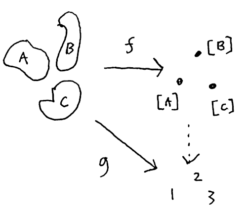
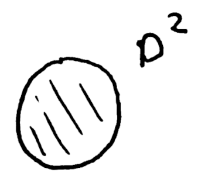
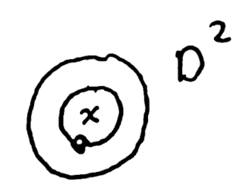
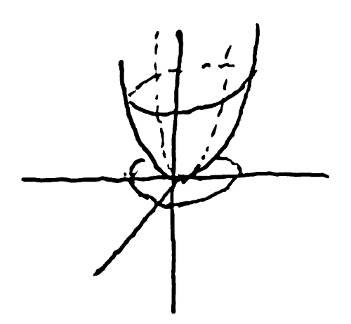
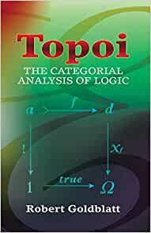

The Universal Property of Quotients
====================================

**11/15/20**

The first time you encounter a theorem concluding with "an arrow that
makes the diagram commute" can be quite confusing.
But with a little thought you can typically find that the idea expressed the theorem is obvious.
The provided arrow is simply the one thing that could possibly fit.
It may be tedious to construct, but understanding the theorem clarifies
why it must always be there, revealing patterns hidden in the construction.

Let's see how this works by studying the universal property of quotients, which was
the first example of a commutative diagram I encountered.
If you are familiar with topology, this property
applies to quotient maps.
But we will focus on quotients induced by equivalence relation on sets and ignorea
additional structure.

An equivalence relation `~` is a binary relation satisfying the following propertys:

- reflexive: `x ~ x`
- symmetrix: `x ~ y <=> y ~ z`
- transitive:  `x ~ y and y ~ z implies x ~ z`.

Examples include equality of real numbers, whether numbers are both even or odd (parity),
matrix similarity, isomorphism, etc.

**Excercise:** Prove matrix similarity is an equivalence relation.

Given an equivalance relation ~ and an element `x` we can form it's equivalence
class `[x]` which is the set of things equivalent to it.
The set of a equivalence classes form a new set `X/~` with an analagous
structure to the original, but with portions "grouped up" or "collapsed"

**Exercise:** Prove distinct equivalence classes are disjoint.

## Universal Property of Quotients

Let `q(x) = [x]` be a map from an element to it's equivalence class.
Given a map `f` from `X` to `Y` which is constant on equivalence
classes (`q(x) = q(y) => f(x) = f(y)`),
we obtain a unique map from `X/~` to `Y` making the diagram commute.

What is going on here? `f` isn't just any map,
it's constant on equivalent elements of `X`.
So a lot of the information in `X` isn't really needed to compute the image of `f`.
Since equal elements get sent to the same place,
we could imagine picking just one element from each class and seeing where it goes.

In other words, we could define a function on each equivalence class.
This map would have the same image as `f` and this is precisely what the universal property tells us
is possible

Let's apply this theorem to a particular example and attempt to fill in the diagram.
Suppose our domain is the solid disc.

To construct an equivalence relation on the disk, think of  properties that make points in the disc similar to one another.
One such property is their distance from the center.
Define `x ~ y` whenever `||x|| ~ ||y||`.
What does the quotient space `X/~` look like under this relation?
Each class is a ring at a particular radius `L`, so denote it `[L]`.
The radii of course vary contiuously so we get set of classes isomorphic
to a closed interval `[0, 1]`.

**Exercise:** Find an equivalence relation on D^2 without 0 (punctured disc) whose classes
form the circle.

Now define a function `f(x) = x^2 + y^2` so our codomain is the real numbers R.
The graph is a multivariable calculus style paraboloid living in `R^3` above
the unit disc:

Can we apply the universal property?
Almost, we need to confirm `f` is constant on equivalence classes.
Suppose `(x, y) ~ (a, b)`.
Then `sqrt(x^2 + y^2) = sqrt(a^2 + b^2)`.
Squaring both sides we get that `f(x, y) = f(a, b)`.

Ah! We can clearly see `f` only depends on radius.
No matter what angle you are at `f` does the same thing.
So the disc is more information than we need,
we can define a similar function on the space of equivalence classes `X/~ = [0, 1]`.
Can you figure out what it is?

...

The missing function is of course `h([L]) = L^2`.
It's graph is a parabola in 2D which carves out the same range as `f` in the real numbers.

To check commutativity take a point `(x, y)` and apply `f(x, y) = x^2 + y^2`.
Now send it to it's equivalence class `q(x, y) = [L]` where `L = sqrt(x^2 + y^2)`.
Now `h(L) = x^2 + y^2 = f(x, y)`.

Easy right? You probably could see right away that `f` was just the square of the distance.
In other examples constructing such a function `h` might be less obvious,
but the universal property tells us it is always there.

Next time you an encounter a commutative diagram proof, try a few examples
to figure out what basic idea it is telling you.

**Exercise:** Prove that `h` is unique. No other function could make the diagram commute.

## Further Reading

Commutative diagrams are the central focus of category theory which attempst to understand
such properties at a higher level of abstrcation than set theory.
From a category theory perspective the quotient set `X/~` is the co-equilizer
or co-limit of the diagram projecting and equivalent pair to it's parts.

You can read more about category theory from Topoi by Robert Goldblatt.

[][4]

Free groups provide another elementary example of universal properties.
You can read about them in chapter 6.3 of Abstract Algebra by Dummit and Foote.

[][2]

Quotient spaces are studied in depth in Topology by Munkres.

[][3]

 The later chapter on Algebraic Topology have
mroe elaborate constructions.
These gave me a lot of practice with commutative diagrams,
such as the chapter on [Seifert-Van Kampen's][1] theorem.

[1]: https://en.wikipedia.org/wiki/Seifert%E2%80%93van_Kampen_theorem
[2]: https://www.amazon.com/gp/product/0471433349/ref=as_li_tl?ie=UTF8&camp=1789&creative=9325&creativeASIN=0471433349&linkCode=as2&tag=jmeiners-20&linkId=4295d44052521c73c93e090190c032f0
[3]: https://www.amazon.com/gp/product/0134689518/ref=as_li_tl?ie=UTF8&camp=1789&creative=9325&creativeASIN=0134689518&linkCode=as2&tag=jmeiners-20&linkId=a1ca862d48cd664489c7179c1f7bfdaf
[4]: https://www.amazon.com/gp/product/B00DP7UMC6/ref=as_li_tl?ie=UTF8&camp=1789&creative=9325&creativeASIN=B00DP7UMC6&linkCode=as2&tag=jmeiners-20&linkId=c7f03020c8207f7d6ba3dc63bb0be29f

